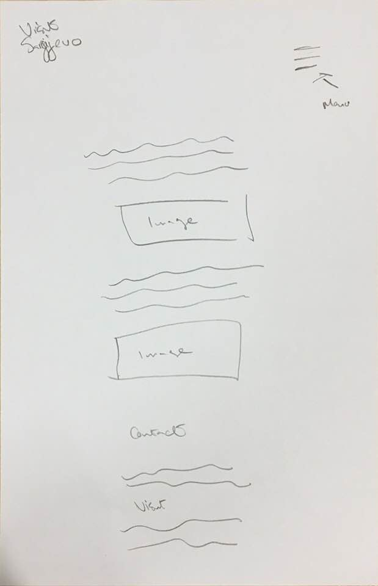
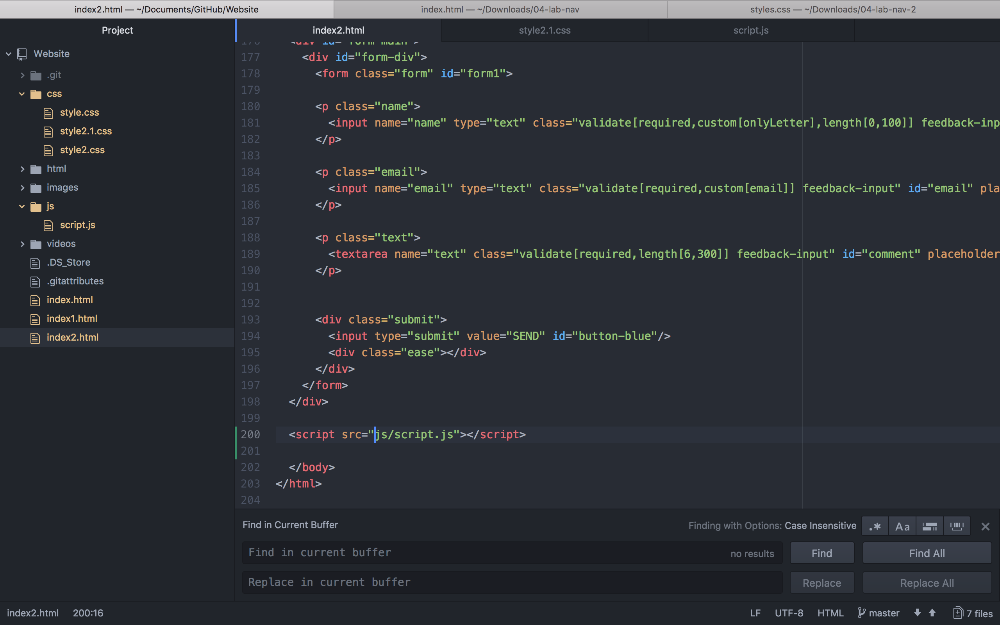
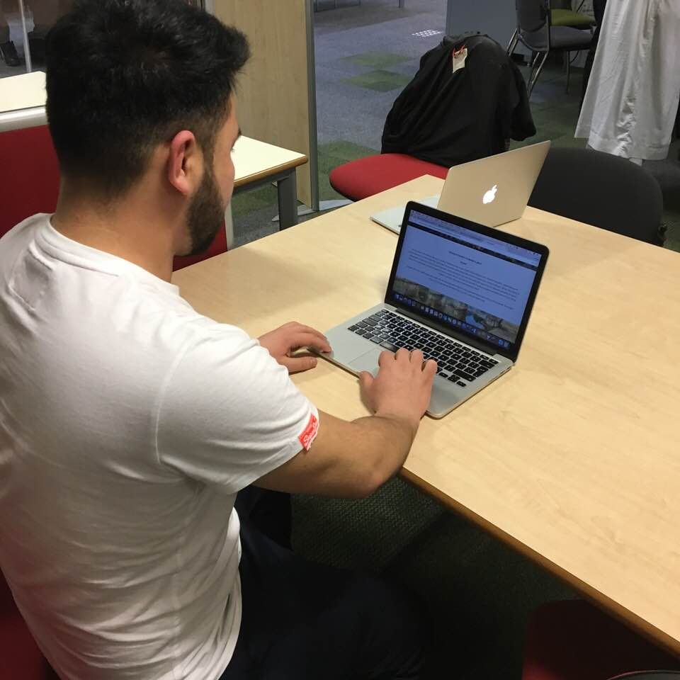

# Sarajevo
The website is informative as well as aiming to promote more tourism in the city of Sarajevo of Bosnia and Herzegovina. The website has been designed as a single page app in a parrallax way as this is a modern way in which websites are created. This can be seen when clicking a link a whole new page is not loaded but the page scrolls down to the relevant information. The first section would be an introduction to Sarajevo, boasting about what it has to offer, creating further interest, the next section would be about the some of the best areas to visit. Anyone looking to visit will be looking for ideas on what activities to do while on their vacation or trip whether it be to enjoy their time or for business.

# Wireframes
## Mobile View

## Desktop

# Issues

The hardest task was to figure out what to do alongside not being able to do any work
because your laptop sustained water damage while abroad in the city of sarajevo. But it did
give me the opportunity to the traditional method of putting pen to paper and think about
what i might want to do. This is an explanation for the big gap between the time the repository
was created and the first or second commit.

HTML did not produce so many errors, but most of the errors were the similar, so it wasn't very difficult to debug. There was one typo error that was due to an extra letter in a file name.

The CSS Validator was producing a parse error. This was because of a missing ";" in the code which was causing this error. This was fixed but showed the importance of a single missed syntax. This had not broken the website but was causing it be unexpectedly laid out.

JavaScript Error in console because when running on chrome, google says this is a bug in the validator and edge and mozilla run without this error. Another error on the live github link is that the svg image links are not "https" therefore it is giving a "mixed content" error

# User Testing
Mustafa Sami, Soyeb Patel and Mohammed Kharodia test the website, checking each link and button to ensure they are responding as expected and giving their opinion on the usibility of the website. I asked that they thoroughly test this and Mustafa mentioned that when the screen is smaller than 480px some text starts to overlap. He suggested that this could be fixed by altering the size of he text. I took this input onboard to make my page more responsive and user friendly.

# PARC and Accesibility
Colour scheme was kept consistent with 3 dominating colours as welll as teh genral theme of the site.
The colours i decided to use and implement in the website layout and structure were grey white and dark grey as they contrast well and contain an element of nutrality.
I have kept the sizing the same as well and made sure their proximity i.e how close similar content is to each other. was in line with its definition
The sizing and proximity were kept the relatively the same over the page for similar content. This aids in making the user very quickly familiar and having a great experience on the website.
In regards to accessibility there were many things implemented to ensure that there was ease of access for users accessing the site. One of which is the alt tags in the images so that a blind person would be able to navigate around the website better.

# references
code amended to suit the purposes of the website from W3Schools, Codepen and Labs. Some references have been listed below from where i got inspiration and gathered some useful tips as well as learn a lot in the process of creating my website..

https://validator.w3.org/
https://codepen.io/-J0hn-/pen/XRqzqG
https://codepen.io/madalintudose/pen/ILmAg?q=navigation+menu+&limit=all&type=type-pens
https://www.youtube.com/watch?v=pRFulaWEePE&feature=youtu.be
https://www.youtube.com/watch?v=JttTcnidSdQ&index=7&list=PLillGF-RfqbZTASqIqdvm1R5mLrQq79CU
https://www.hexcolortool.com/#134e7c
https://jigsaw.w3.org/css-validator
https://codepen.io/dudleystorey/details/knqyK/
https://www.w3schools.com/tags/tag_span.asp
https://www.cssdesignawards.com/sites/pop-pays-a-year-worth-sharing/32052/
